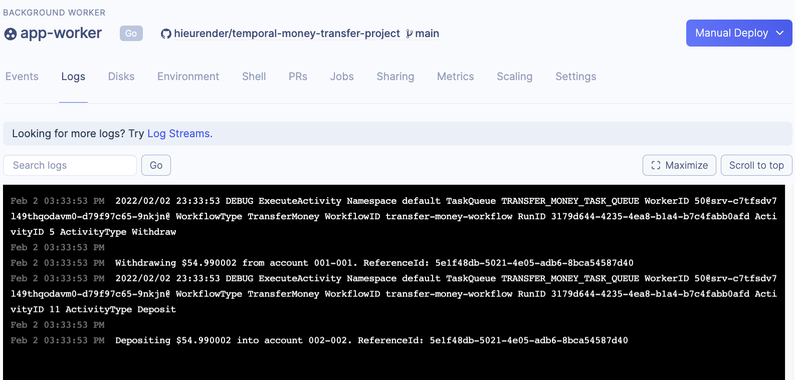

[](https://render.com/deploy)

# Temporal 

This is a template for running a production Temporal cluster on Render.

Here are the components in the render.yaml:
- Temporal cluster:
  - Two Postgres databases, `temporal` and `temporal-visibility`..
  - The four Temporal services: `temporal-frontend`, `temporal-matching`, `temporal-history`, and `temporal-worker`, with basic autoscaling configuration.
  - `temporal-admin-tools` provides the `tctl` command.
  - `temporal-web` provides the Temporal UI.
- Example app (based on Temporal's [Go SDK Example](https://github.com/temporalio/money-transfer-project-template-go)):
  - `app-workflow-trigger` runs a simple HTTP server with two routes:
    - `/` for health checking.
    - `/trigger-workflow` for kicking off the `TransferMoney` workflow.
  - `app-worker` executes any triggered workflows.

# Steps

1. Click the "Deploy to Render" button.
2. In your Render dashboard, click on the service `app-workflow-trigger`, and copy its URL. Let's say it's `https://app-workflow-trigger.onrender.com/`.
3. Go to `https://app-workflow-trigger.onrender.com/`. If everything is well, you will see "OK!".
4. Now go to `https://app-workflow-trigger.onrender.com/trigger-workflow`. It should print
```
Transfer of $54.990002 from account 001-001 to account 002-002 is processing. ReferenceID: 5e1f48db-5021-4e05-adb6-8bca54587d40

WorkflowID: transfer-money-workflow RunID: 3179d644-4235-4ea8-b1a4-b7c4fabb0afd
```
5. `app-worker` will immediately pick up and run this workflow. You can verify by clicking on the service, and going to the "Logs" tab:

6. To check that the workflow has been run successfully, click on the `temporal-web` service, and go to its URL. Under the `default` namespace, you should find your workflow's run with the status "Completed".
